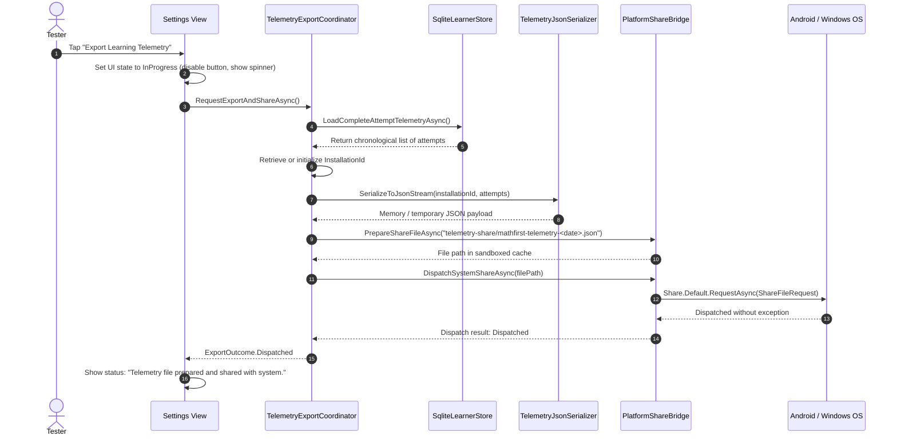
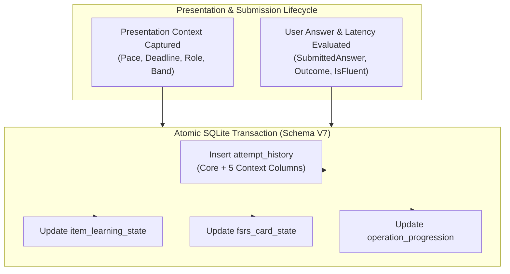

# MathFirst Design Specification: MF-TELEM-001 Tester Telemetry Export and Share

**Package ID:** `MF-TELEM-001`  
**Title:** Tester Telemetry Export and Share  
**Status:** Approved Design Specification — Implementation Pending  
**Date:** 2026-09-28  
**Document Mode:** `DOCUMENT_ONLY`  
**Governing Architecture Records:** [ADR-0001](../../decisions/ADR-0001-cross-platform-application-topology-and-stack-baseline.md), [ADR-0002](../../decisions/ADR-0002-offline-execution-and-local-persistence-boundary.md), [ADR-0004](../../decisions/ADR-0004-adaptive-pace-fast-acquisition-and-practice-interventions.md), [ADR-0005](../../decisions/ADR-0005-acclimation-timing-and-rapid-dense-progression.md), [ADR-0008](../../decisions/ADR-0008-independent-per-operation-role-ordinals-and-practice-configuration-reconciliation.md), [ADR-0010](../../decisions/ADR-0010-evidence-adaptive-discovery-operation-specific-guided-decoupling-and-pace-calibration.md), [ADR-0011](../../decisions/ADR-0011-tester-telemetry-persistence-export-and-share.md)  
**Authoritative Product Contract:** [docs/PRODUCT.md](../../PRODUCT.md)  

---

## 1. Title / Package ID

- **Package Identifier:** `MF-TELEM-001`
- **Package Title:** Tester Telemetry Export and Share
- **Lifecycle Classification:** Feature / Persistence / Native Integration

---

## 2. Status

**Approved Design Specification — Implementation Pending.**  
Architecture decisions and package contracts are approved via [ADR-0011](../../decisions/ADR-0011-tester-telemetry-persistence-export-and-share.md). Application source implementation has not started. Implementation planning will be authored in a subsequent authorized lifecycle phase.

---

## 3. Product Problem

MathFirst is an offline-first mental arithmetic application designed to optimize both arithmetic correctness and retrieval speed through spaced retrieval and adaptive pace estimation. Currently, real tester feedback is qualitative and anecdotal. While automated simulation benchmarks (such as the 482-attempt normative strong-learner benchmark established in MF-LEARN-006) demonstrate engine correctness under synthetic assumptions, real human learners exhibit wide cognitive variance:
- Young children (e.g. four- to six-year-olds) require generous initial response windows (15–30 seconds) and distinct acclimation dynamics;
- Fast adult learners require rapid adaptation without artificial delay;
- Motor latency differences on mobile keypads vary significantly across age groups and device form factors.

To design an empirical, data-driven **Adaptive Timing and Early Calibration Redesign**, repository contributors require authentic, machine-analyzable learning telemetry from real testers across diverse demographics. However, MathFirst operates under a strict offline-first, zero-telemetry-backend privacy invariant: the app has no user accounts, no remote server, no background analytics SDK, and requests zero Android network permissions (`INTERNET`, `ACCESS_NETWORK_STATE`).

Therefore, MathFirst requires a mechanism allowing human testers to manually, deliberately export their local learning telemetry and share it via standard system channels (such as email, messaging apps, or cloud storage) while strictly preserving offline operation, cryptographic pseudonymity, data minimization, and sandboxed storage boundaries.

---

## 4. Goals

1. **Manual User-Initiated Telemetry Export**: Provide a dedicated affordance in the Settings page allowing a tester to export local practice history with an explicit user action.
2. **Native Platform Share Flow**: Integrate with the native .NET MAUI Share subsystem (`Share.Default.RequestAsync`) to surface the platform share sheet (e.g., Android chooser), allowing transmission via user-selected targets (email, messaging, Drive, or file saving).
3. **Machine-Analyzable Schema v1 JSON**: Produce a deterministic, self-contained, canonical JSON export containing complete retained attempt history with minimal metadata.
4. **Enriched Presentation-Time Context**: Capture presentation-time learning state (`presented_deadline_ms`, `expected_pace_ms`, `resolved_role`, `operation_band_before`) at the exact millisecond a fact is presented, persisting it atomically with the attempt transaction in SQLite **Schema V7**.
5. **Lossless Legacy History Preservation**: Maintain 100% compatibility with pre-V5 unpositioned attempts and V5/V6 positioned attempts by declaring historical presentation context explicitly `null`.
6. **Strict Data Minimization**: Export only pedagogically necessary mathematical evidence. Exclude submission IDs, correct answers, correctness flags, names, hardware identifiers, account IDs, IP addresses, location data, tester labels, and combat/gameplay state.
7. **Pseudonymous Installation Identification**: Include a locally generated, durable, random UUID (`installation_id`) to correlate multiple sequential export files from the same installation across practice sessions, decoupled from hardware identity and cleared during Full Local Reset.
8. **Sandboxed FileProvider Security**: Strictly restrict Android FileProvider sharing to a dedicated subfolder (`FileSystem.CacheDirectory/telemetry-share/`) without exposing parent cache directories, app data directories, or the SQLite database.
9. **Truthful UI State and Semantics**: Accurately reflect export generation and OS dispatch without fabricating claims of successful network transmission.
10. **Clean Architectural Decoupling**: Keep combat mechanics (Cyber Defense) isolated as presentation-only consumers with zero presence in learning telemetry, and maintain import/restore as a separate, unentangled future concern.

---

## 5. Non-Goals

1. **No Background or Automatic Telemetry**: No automatic, scheduled, silent, or background data transmission. Telemetry export occurs strictly when the user manually taps the export action.
2. **No Network SDK or Remote Server**: No inclusion of Google Analytics, Firebase, Sentry, or custom HTTP ingestion endpoints. The application remains strictly offline and requests zero network permissions.
3. **No Telemetry Import or Restore**: Telemetry import, backup restoration, cross-device synchronization, and state merging are explicitly out of scope for MF-TELEM-001.
4. **No Reverse Telemetry from Game Mechanics**: Cyber Defense combat state (enemy HP, boss tiers, attack animations, critical recoil, combo counts) is strictly excluded from persistence and export.
5. **No Inclusion of Redundant or Identifying Data**: No user-entered tester names, subject notes, device serials, Android IDs, MAC addresses, or derived hardware fingerprints.
6. **No Serialization of Evaluated Correctness or Submission IDs**: The export schema omits `correct_answer`, `is_correct`, and `submission_id`. Downstream analysis tools derive correctness deterministically from canonical fact operands and `submitted_answer`.
7. **No Backfilling of Historical Rows**: Existing rows in SQLite are never retroactively backfilled with synthetic or guessed presentation context.

---

## 6. User Workflow

The export and share workflow is completely user-driven and contained within the native UI:



### Detailed Workflow Steps:
1. **Navigation**: User opens the **Settings** view in MathFirst and navigates to the "Tester Tools / Diagnostics" section.
2. **Action Trigger**: User taps the button labeled **"Export & Share Telemetry"** (localized across EN, DE, RU).
3. **Transient UI State**: The button enters a busy state, disabling duplicate clicks and rendering a localized progress indicator ("Preparing export...").
4. **Payload Generation**:
   - Query complete attempt history ordered deterministically (see Section 15);
   - Read or lazily generate durable `InstallationId`;
   - Format JSON payload adhering to `telemetry_export_schema_v1`;
   - Write payload to a unique file in the dedicated sandboxed directory `FileSystem.CacheDirectory/telemetry-share/`.
5. **System Dispatch**: The application invokes .NET MAUI's `Share.Default.RequestAsync`, passing the sandboxed file.
6. **Platform Chooser**: The native operating system displays the share sheet / chooser dialog.
7. **UI Resolution**: The application UI transitions to a neutral, truthful confirmation state: *"Export prepared and handed off to the system."*

---

## 7. Current Repository Baseline

- **Persistence Layer**: Currently **Schema V6**, governed by [ADR-0002](../../decisions/ADR-0002-offline-execution-and-local-persistence-boundary.md), [ADR-0004](../../decisions/ADR-0004-adaptive-pace-fast-acquisition-and-practice-interventions.md), [ADR-0005](../../decisions/ADR-0005-acclimation-timing-and-rapid-dense-progression.md), [ADR-0008](../../decisions/ADR-0008-independent-per-operation-role-ordinals-and-practice-configuration-reconciliation.md), [ADR-0009](../../decisions/ADR-0009-guided-four-operation-number-space-gate.md), and [ADR-0010](../../decisions/ADR-0010-evidence-adaptive-discovery-operation-specific-guided-decoupling-and-pace-calibration.md).
- **Existing `attempt_history` Table Schema (V6)**:
  ```sql
  CREATE TABLE attempt_history (
      submission_id TEXT PRIMARY KEY,
      fact_id TEXT NOT NULL,
      operation TEXT NOT NULL,
      left_operand INTEGER NOT NULL,
      right_operand INTEGER NOT NULL,
      submitted_answer INTEGER,
      correct_answer INTEGER NOT NULL,
      is_correct INTEGER NOT NULL,
      is_fluent INTEGER NOT NULL CHECK (is_fluent IN (0, 1))
          CHECK (is_fluent = 0 OR (is_correct = 1 AND outcome = 'Correct')),
      outcome TEXT NOT NULL DEFAULT 'Incorrect',
      response_latency_ms INTEGER NOT NULL,
      timestamp TEXT NOT NULL,
      practice_position INTEGER CHECK (practice_position IS NULL OR practice_position > 0)
  );
  ```
- **Historical Rows**:
  - Pre-V5 attempts have `practice_position = NULL`.
  - V5/V6 attempts have `practice_position > 0`.
- **Limitation of V6 Baseline**: Presentation context (`presented_deadline_ms`, `expected_pace_ms`, `resolved_role`, `operation_band_before`) is computed ephemerally in `TrainingSession` and `AdaptivePracticeSelector` but discarded upon submission. Only the raw outcome and latency are persisted. This renders Schema V6 insufficient for fine-grained empirical timing analysis.

---

## 8. Data-Minimization Principles

Under the MathFirst Privacy and Data Governance Policy:
1. **Mathematical Evidence Only**: Telemetry records arithmetic facts presented, user responses, latency, and pacing state. No subjective notes, learner demographics, or profiling information are stored or exported.
2. **No Hardware Identifiers**: The export never includes MAC addresses, IMEI, Android ID (`Settings.Secure.ANDROID_ID`), device serial numbers, or advertising IDs.
3. **No Network Identifiers**: No IP addresses, Wi-Fi SSIDs, or network telemetry are captured.
4. **No Free-Text Fields**: No user-entered names or tester labels are included in the export.
5. **No Derived Redundancies**: Evaluated correctness (`is_correct`) and correct answers are excluded; downstream analytics scripts recalculate correctness from canonical fact definitions ($2 + 2 = 4$).
6. **No Internal Technical Tokens**: SQLite row IDs and internal UUID `submission_id` tokens are stripped from the export payload.
7. **Local Pseudonymity**: The export uses a single, random, application-generated UUID (`installation_id`) created locally on the device.

---

## 9. Persistence Architecture

### Atomically Enriched `attempt_history` in Schema V7
MathFirst rejects the complexity and synchronization hazards of a telemetry sidecar database or a dual-write event log. All learning and timing telemetry is stored directly in the canonical `attempt_history` table in SQLite.



### Invariants:
- Atomic commit: Attempt record, item learning state, FSRS card state, and band progression commit in exactly one SQLite transaction.
- Zero dual-write risk: There is no secondary database file or uncoordinated file log that could drift or corrupt.
- Performance: Inserting five additional nullable columns into the existing single-row insert introduces unmeasurable overhead ($< 0.1\text{ ms}$).

---

## 10. Schema V7 Migration Contract

The database version transitions from **6** to **7**.

### SQLite Migration Script:
```sql
-- Step 1: Add five nullable context columns to attempt_history
ALTER TABLE attempt_history ADD COLUMN attempt_context_version INTEGER NULL;
ALTER TABLE attempt_history ADD COLUMN presented_deadline_ms INTEGER NULL;
ALTER TABLE attempt_history ADD COLUMN expected_pace_ms INTEGER NULL;
ALTER TABLE attempt_history ADD COLUMN resolved_role TEXT NULL;
ALTER TABLE attempt_history ADD COLUMN operation_band_before INTEGER NULL;

-- Step 2: Bump schema version in schema_info to 7
UPDATE schema_info SET value = '7' WHERE key = 'schema_version';
```

### Migration Invariants:
1. **Lossless Evolution**: All existing rows in `attempt_history`, `item_learning_state`, `fsrs_card_state`, and `operation_progression` are preserved verbatim.
2. **Explicit Nulls for Legacy Data**: Existing historical rows receive `NULL` for all five new columns. No default values or synthetic values are backfilled.
3. **Idempotence**: The migration checks `PRAGMA table_info(attempt_history)` before issuing `ALTER TABLE` to ensure safe retry across interrupted startups.
4. **Target Only**: Schema V7 is the target schema of package MF-TELEM-001. Schema V6 remains the live active schema until MF-TELEM-001 implementation is executed.

---

## 11. Attempt Context Versioning

The `attempt_context_version` column provides clear schema independence for attempt rows:

- **`attempt_context_version IS NULL` (Legacy Context)**:
  Applies to all attempts recorded prior to Schema V7 deployment. Indicates that presentation-time context was not captured. Applies to both unpositioned pre-V5 rows and positioned V5/V6 rows.
- **`attempt_context_version = 1` (Enriched Context v1)**:
  The first enriched presentation context version, populated for all attempts recorded under Schema V7.
- **Independence from `practice_position`**:
  `practice_position` indicates global chronological attempt ordering; `attempt_context_version` indicates presentation instrumentation schema. They are orthogonal. A row may have a positive `practice_position` while having `attempt_context_version = NULL` (V5/V6 rows).
- **Prohibition of Synthetic Backfill**:
  Historical rows must never be updated to `attempt_context_version = 1`.

---

## 12. Presentation-Time Capture Contract

When an exercise is selected and presented to the learner, a transient `AttemptPresentationContext` structure is captured in `TrainingSession`:

```csharp
public sealed record AttemptPresentationContext(
    int ContextVersion,
    int? PresentedDeadlineMs,
    int ExpectedPaceMs,
    string ResolvedRole,
    int OperationBandBefore);
```

### Exact Field Derivation:
1. **`ContextVersion`**: Constant `1` for the initial implementation.
2. **`PresentedDeadlineMs`**:
   - In Standard or Floor Practice Time modes: The exact positive integer deadline presented to the learner (e.g. `4500`, `9000`, `30000`).
   - In No Time Pressure mode (`NoTimePressure = -1`): `null`.
3. **`ExpectedPaceMs`**: The learner's hierarchical shrinkage pace estimate $P_{\text{fact}}$ for the presented fact at the moment of presentation, clamped to $[600, 12000]\text{ ms}$.
4. **`ResolvedRole`**: The string representation of the authoritative `PracticeSelectionResult.ResolvedRole`.
   - Permitted enum string values: `"New"`, `"Due"`, `"Maintenance"`, `"Frontier"`, `"Remediation"`, `"EarlyReview"`.
   - Note: `"AnyMaterialized"` is preserved in the domain enum for backward compatibility but is unreachable in production selector resolution.
   - Raw enum strings are stored directly. No synthetic categorization (e.g. "Acquisition", "Review", "Retry") is permitted.
5. **`OperationBandBefore`**: The `BandIndex` of the presented operation's `OperationProgression` at the time of presentation.

### Invariant:
If configuration reconciliation or operation switching discards an unsubmitted exercise, the transient `AttemptPresentationContext` is discarded with zero persistence.

---

## 13. Final Telemetry Export Contract

The export payload is a single UTF-8 JSON document adhering to `telemetry_export_schema_v1`.

### Version Nomenclature Clarity
To prevent domain confusion during implementation and analysis, the specification explicitly distinguishes three independent version domains:
1. **JSON Export Envelope (`schema_version = 1`)**:
   Defines the top-level schema version of the exported JSON document payload (`telemetry_export_schema_v1`).
2. **Per-Attempt Presentation Context (`context_version = null` or `1`)**:
   Defines the per-attempt presentation-time instrumentation payload schema (`null` for legacy uninstrumented rows, `1` for enriched context v1 rows).
3. **SQLite Learner-Store Schema (`Schema V6` live, `Schema V7` target)**:
   Defines the underlying relational database storage schema managed by `SqliteLearnerStore`.

These three version concepts represent distinct, independent versioning scopes and MUST NOT be conflated.

### Top-Level Document Structure:
```json
{
  "schema_version": 1,
  "exported_at": "2026-09-28T14:32:00Z",
  "app_version": "1.0.0",
  "build_classification": "Tester",
  "installation_id": "c4b1e5a2-8f9d-4e12-b7a3-5c8e1f0a9b2d",
  "attempt_count": 4,
  "attempts": [
    ...
  ]
}
```

### Attempt Array Element Schema:
```json
{
  "fact_id": "add:2+3",
  "operation": "Addition",
  "left_operand": 2,
  "right_operand": 3,
  "submitted_answer": 5,
  "outcome": "Correct",
  "is_fluent": true,
  "response_latency_ms": 1420,
  "timestamp": 1774780000000,
  "practice_position": 1,
  "context_version": 1,
  "presented_deadline_ms": 4500,
  "expected_pace_ms": 2100,
  "resolved_role": "New",
  "operation_band_before": 0
}
```

### Complete Field Dictionary:
| Field Name | Type | Nullable | Description |
|---|---|---|---|
| `fact_id` | string | No | Canonical fact ID (`add:<l>+<r>`, `sub:<l>-<r>`, `mul:<l>*<r>`, `div:<l>/<r>`). |
| `operation` | string | No | Canonical arithmetic operation name (`"Addition"`, `"Subtraction"`, `"Multiplication"`, `"Division"`). |
| `left_operand` | integer | No | Left operand of the arithmetic problem. |
| `right_operand` | integer | No | Right operand of the arithmetic problem. |
| `submitted_answer` | integer | Yes | The integer answer submitted by the learner; `null` when no answer was submitted, including timeout attempts. |
| `outcome` | string | No | Domain AttemptOutcome name (`"Correct"`, `"Incorrect"`, `"Timeout"`). |
| `is_fluent` | boolean | No | Whether the attempt satisfied adaptive fluency thresholds at submission. |
| `response_latency_ms`| integer | No | Raw response latency in milliseconds. |
| `timestamp` | integer | No | Unix epoch millisecond timestamp of submission. |
| `practice_position` | integer | Yes | Global monotonic attempt ordinal (null for pre-V5 legacy attempts). |
| `context_version` | integer | Yes | Context schema version (null for legacy rows, 1 for enriched rows). |
| `presented_deadline_ms`| integer | Yes | Presented countdown deadline in ms (null under No Time Pressure or legacy). |
| `expected_pace_ms` | integer | Yes | Fact pace estimate $P_{\text{fact}}$ at presentation (null for legacy). |
| `resolved_role` | string | Yes | Resolved role string (null for legacy). |
| `operation_band_before`| integer | Yes | Operation progression band before attempt evaluation (null for legacy). |

---

## 14. Historical Compatibility & Five Semantic Examples

The export format losslessly represents all past and future attempts across historical and enriched eras:

### Example A: Pre-V5 Legacy Attempt (Unpositioned, No Context)
Recorded before global Practice Position existed:
```json
{
  "fact_id": "add:1+1",
  "operation": "Addition",
  "left_operand": 1,
  "right_operand": 1,
  "submitted_answer": 2,
  "outcome": "Correct",
  "is_fluent": true,
  "response_latency_ms": 1150,
  "timestamp": 1774000000000,
  "practice_position": null,
  "context_version": null,
  "presented_deadline_ms": null,
  "expected_pace_ms": null,
  "resolved_role": null,
  "operation_band_before": null
}
```

### Example B: V5/V6 Positioned Legacy Attempt (Positioned, No Context)
Recorded after Practice Position was established, but prior to Schema V7:
```json
{
  "fact_id": "sub:5-2",
  "operation": "Subtraction",
  "left_operand": 5,
  "right_operand": 2,
  "submitted_answer": 3,
  "outcome": "Correct",
  "is_fluent": true,
  "response_latency_ms": 1820,
  "timestamp": 1774500000000,
  "practice_position": 42,
  "context_version": null,
  "presented_deadline_ms": null,
  "expected_pace_ms": null,
  "resolved_role": null,
  "operation_band_before": null
}
```

### Example C: Future Enriched Timed Attempt (Positioned, Context v1, Timed)
Recorded under Schema V7 with an active countdown timer:
```json
{
  "fact_id": "mul:3*4",
  "operation": "Multiplication",
  "left_operand": 3,
  "right_operand": 4,
  "submitted_answer": 12,
  "outcome": "Correct",
  "is_fluent": true,
  "response_latency_ms": 1650,
  "timestamp": 1774800000000,
  "practice_position": 105,
  "context_version": 1,
  "presented_deadline_ms": 4500,
  "expected_pace_ms": 2200,
  "resolved_role": "Due",
  "operation_band_before": 2
}
```

### Example D: Future Enriched No Time Pressure Attempt (Positioned, Context v1, NTP)
Recorded under Schema V7 with No Time Pressure mode enabled:
```json
{
  "fact_id": "div:12/3",
  "operation": "Division",
  "left_operand": 12,
  "right_operand": 3,
  "submitted_answer": 4,
  "outcome": "Correct",
  "is_fluent": true,
  "response_latency_ms": 3410,
  "timestamp": 1774805000000,
  "practice_position": 106,
  "context_version": 1,
  "presented_deadline_ms": null,
  "expected_pace_ms": 2200,
  "resolved_role": "Frontier",
  "operation_band_before": 1
}
```

### Example E: Future Enriched Timeout Attempt (Positioned, Context v1, Timeout)
Recorded under Schema V7 where the presentation countdown expired before an answer was submitted:
```json
{
  "fact_id": "add:7+8",
  "operation": "Addition",
  "left_operand": 7,
  "right_operand": 8,
  "submitted_answer": null,
  "outcome": "Timeout",
  "is_fluent": false,
  "response_latency_ms": 4500,
  "timestamp": 1774810000000,
  "practice_position": 107,
  "context_version": 1,
  "presented_deadline_ms": 4500,
  "expected_pace_ms": 2300,
  "resolved_role": "Remediation",
  "operation_band_before": 1
}
```

---

## 15. Deterministic Export Ordering

To guarantee deterministic, byte-reproducible export outputs across executions:
1. **Positioned Attempts (`practice_position IS NOT NULL`)**:
   Ordered strictly by `practice_position ASC`.
2. **Legacy Unpositioned Attempts (`practice_position IS NULL`)**:
   Ordered by `timestamp ASC`, with `submission_id ASC` as the stable internal SQL tie-breaker. (Note: `submission_id` is queried solely for deterministic query sorting and is excluded from the serialized JSON output).
3. **SQLite `rowid` Exclusion**: SQLite internal `rowid` must not be used as a tie-breaker, as database vacuum or table rebuild operations can alter row IDs.
4. **Complete Scope**: Export includes all retained compatible rows from `attempt_history`.

---

## 16. Installation Identifier & Pseudonymity

- **Concept**: A persistent pseudonymous installation ID (`installation_id`) correlates sequential export payloads from the same tester (e.g. before and after practicing) without collecting personal data.
- **Generation**: Generated on first use via `Guid.NewGuid().ToString("D")`.
- **Storage**: Stored in application preferences / persistent key-value storage (`Preferences.Default` or local configuration store) under key `mathfirst.telemetry.installation_id`.
- **Lifecycle & Reset Contract**:
  - `Reset Learning Progress`: Clears attempts and FSRS states, but **preserves** `installation_id`.
  - `Restore Default Settings`: Restores defaults, but **preserves** `installation_id`.
  - `Full Local Reset (Reset All Application Data)`: Clears all data and **removes** `installation_id`. A subsequent export will generate a fresh UUID.
  - `Application Uninstall`: Removed with app sandbox data by the OS.

---

## 17. Android Share Architecture

MathFirst utilizes .NET MAUI's cross-platform sharing API:
```csharp
await Share.Default.RequestAsync(new ShareFileRequest
{
    Title = "Share MathFirst Telemetry",
    File = new ShareFile(fullFilePath, "application/json")
});
```

On Android, this internally constructs an `Intent.ACTION_SEND` with a content URI generated by Android's `FileProvider`.

---

## 18. FileProvider Security

To adhere to the principle of least privilege and prevent directory traversal or data exposure:

1. **Dedicated Cache Directory**: Share files are created strictly within:
   ```text
   FileSystem.CacheDirectory/telemetry-share/
   ```
2. **Explicit Android Resource Override**: MAUI's default FileProvider paths must be configured via:
   `Platforms/Android/Resources/xml/microsoft_maui_essentials_fileprovider_file_paths.xml`
3. **Strict Mapping**:
   ```xml
   <?xml version="1.0" encoding="utf-8"?>
   <paths xmlns:android="http://schemas.android.com/apk/res/android">
       <cache-path name="telemetry_share" path="telemetry-share" />
   </paths>
   ```
4. **Forbidden Paths**: The following locations MUST NEVER be exposed in `file_paths.xml`:
   - Cache root (`<cache-path name="cache" path="." />`)
   - Internal app data root (`<files-path ... />`)
   - Database directory containing `mathfirst.db`
   - External storage or SD card paths.

---

## 19. Temporary File Lifecycle

Because the native Android share sheet presents an asynchronous chooser and receiving applications (e.g. Gmail, WhatsApp) read the file asynchronously in the background, premature file deletion causes `FileNotFoundException` or empty attachments.

### Lifecycle Rules:
1. **No Immediate Deletion**: Do not delete the export file immediately following `Share.Default.RequestAsync`.
2. **No Deletion on Next Export**: Do not purge files on subsequent exports during an active session.
3. **No Startup Purge**: Do not delete export files during app launch or process start.
4. **No Arbitrary Timers**: No background timers or arbitrary time-to-live daemons.
5. **Operating System Cache Reclamation**: Files reside in `CacheDirectory/telemetry-share/`. The Android operating system automatically reclaims cache files when storage pressure arises.
6. **Full Local Reset**: Explicitly purges all files in `CacheDirectory/telemetry-share/` when the user executes a Full Local Reset.

---

## 20. Share UI & Completion Semantics

### Observable Runtime Boundaries:
MathFirst can know:
- The telemetry JSON file was successfully generated and written to disk;
- `Share.Default.RequestAsync` completed without throwing an exception.

MathFirst CANNOT know:
- Whether the Android chooser was dismissed or answered;
- Which destination application the user selected;
- Whether the receiving application successfully read or uploaded the file.

### Truthful UI Copy Contract:
- **During Export**: *"Generating telemetry file..."*
- **On Dispatch Success**: *"Telemetry file ready and handed off to the system."*
- **On Exception/Failure**: *"Unable to prepare telemetry file. Please try again."*
- **Prohibited Copy**: UI must NEVER state *"Telemetry sent successfully"* or *"Uploaded to developer"*.

---

## 21. Cyber Defense Boundary

The Cyber Defense game mode (governed by [ADR-0010](../../decisions/ADR-0010-evidence-adaptive-discovery-operation-specific-guided-decoupling-and-pace-calibration.md) and MF-UX-008) is strictly a **downstream presentation consumer**:
- Zero combat data (boss identity, sector, HP, shield points, critical hits, combo multipliers, recoil animations) is stored in `attempt_history`.
- Zero combat data is serialized into the telemetry export.
- Learning telemetry remains untainted, authoritative, and pedagogically pure.

---

## 22. Import / Restore Boundary

Telemetry import and data restoration are explicitly **OUT OF SCOPE** for MF-TELEM-001.
- The telemetry export is a one-way diagnostic extraction tool.
- Future import, cloud backup restoration, or multi-device merging requires a separate, independently governed package with its own cryptographic validation, version negotiation, and consistency auditing.

---

## 23. Testing Strategy

All testing must adhere to [docs/TESTING.md](../../TESTING.md) and use **synthetic data only**:

1. **Unit Tests (`MathFirst.Core.Tests`)**:
   - `AttemptPresentationContext` creation and immutability;
   - Serialization and formatting of `telemetry_export_schema_v1`;
   - Verification of the 15 exported fields and exclusion of prohibited fields (`submission_id`, `correct_answer`, `is_correct`);
   - Serialization of the semantic examples (A, B, C, D, E);
   - Deterministic sort ordering (positioned vs. unpositioned);
   - Verification that `installation_id` is a valid UUID and matches format.
2. **Integration Tests (`MathFirst.Infrastructure.Sqlite`)**:
   - Schema V6 to Schema V7 migration script verification;
   - Idempotent migration re-run verification;
   - Insertion and retrieval of attempts with presentation context;
   - Handling of null context in legacy rows;
   - Transactional atomicity (attempt insert rollback on constraint failure).
3. **Mock Share Bridge Contract Tests**:
   - Test `ITelemetryShareService` abstraction with mocked platform interactions;
   - Verify path containment inside `telemetry-share/`;
   - Verify non-blocking lifecycle and truthful return status.

---

## 24. Acceptance Criteria

1. **Schema V7 Migration**: Clean migration from Schema V6 to V7 in SQLite; preserves all existing attempt rows with null context; schema_info updated to schema version 7.
2. **Presentation Context Capture**: Active practice captures deadline, expected pace, resolved role, and operation band at exercise presentation time and commits them atomically with the attempt.
3. **Settings Affordance**: Settings view contains an "Export & Share Telemetry" action with localized labels in English, German, and Russian.
4. **Deterministic JSON Output**: Generated JSON conforms to Schema v1, contains all 15 approved fields, excludes all forbidden fields, and sorts rows deterministically.
5. **Native Share Hand-off**: On Android and Windows, triggering the action invokes the platform share mechanism without crashing.
6. **FileProvider Security**: `microsoft_maui_essentials_fileprovider_file_paths.xml` restricts access exclusively to `telemetry-share/`.
7. **Clean Reset Behavior**: Full Local Reset purges `telemetry-share` cache and regenerates `installation_id`.
8. **Automated Test Coverage**: 100% passing automated unit and integration tests for serialization, migration, and coordinator logic.

---

## 25. Implementation Boundaries

| Allowed File Areas | Forbidden File Areas |
|---|---|
| `src/MathFirst.Core/` (models, serialization contracts) | `src/MathFirst.Core/Fsrs/` (no FSRS modifications) |
| `src/MathFirst.Infrastructure.Sqlite/` (Schema V7 migration, queries) | Any remote networking libraries / HTTP clients |
| `src/MathFirst.Application/` (coordinators, interfaces) | Any background analytics or crash-reporting SDKs |
| `src/MathFirst.App/Components/Pages/Settings.razor` (UI action) | Cloud storage providers |
| `src/MathFirst.App/Platforms/Android/` (FileProvider XML, share bridge) | Android permissions (`INTERNET`, `ACCESS_NETWORK_STATE`) |
| `tests/MathFirst.Core.Tests/` (unit & contract tests) | Modification of user-facing game mechanics |

---

## 26. Risks and Invariants

1. **Risk: Android FileProvider Conflict**: MAUI provides a default FileProvider. Overriding `file_paths.xml` must preserve existing necessary paths if any exist.
   - *Mitigation*: Inspect MAUI's manifest declarations to ensure the provider authority and path XML align without collision.
2. **Invariant: Single Canonical Attempt Source**: All attempt data lives in `attempt_history`. No sidecar databases or dual event logs.
3. **Invariant: Truthful Privacy Position**: MathFirst does not collect data; data export is an explicit, local user action sharing with user-selected applications.
4. **Invariant: Zero Real User Data in Automated Tests**: All tests use synthetic test fixtures, fixed timestamps, and mock UUIDs.

---

## 27. Out-of-Scope Follow-Ups

1. **Adaptive Timing and Early Calibration Redesign**: The empirical redesign of starting deadlines, rapid pace adaptation, and durable pace memory will be executed in a separate, subsequent package informed by telemetry collected from MF-TELEM-001.
2. **Telemetry Ingestion & Analysis Tooling**: External Python/Jupyter or C# data-analysis scripts to aggregate and visualize exported JSON files reside outside the core MathFirst client application.
3. **Telemetry Import / Restore**: Independent package if ever prioritized.
4. **Light-Theme Cyber Defense Visual Reconciliation**: Remains deferred as an independent visual polish task.
