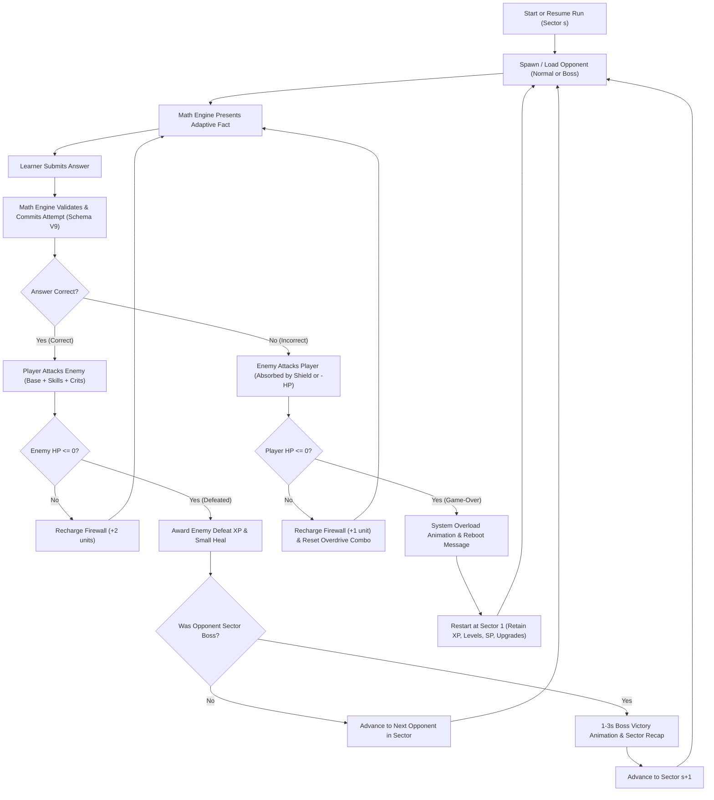

# MathFirst — Cyber Defense Roguelite/RPG
## Target Game Design Document (GDD) & Technical Specification

**Date:** 2026-10-08\
**Status:** Approved Target Game Design Specification — Durable Baseline for Implementation Planning (Not Yet Implemented in Production)\
**Repository:** `Tachiguro/MathFirst`\
**Base Commit:** `main@b9ee8a940ea33d893c406071cc966e1f792e01c8` (Verified 0 open PRs at baseline)\
**Canonical Checkout:** `C:\Dev\MathFirst`\
**Package Family:** P7 (*Deferred / Post-Core*); Implementation dispatched in bounded downstream slices.\
**Release Boundary:** Roadmap Step 55 is **NOT AUTHORIZED**; Build 4 does **NOT EXIST**.

---

### Scope & Authority Legend

To prevent ambiguity during subsequent implementation planning and code generation, all specifications in this document are strictly classified using the following normative markers:

- `[FIXED PRODUCT RULE]` (**FEST**): Confirmed product contract decided by the user. Must not be altered, diluted, re-opened, or silently substituted during implementation.
- `[PRELIMINARY BALANCE VALUE / TUNING]` (**STARTWERT / TUNING**): Concrete technical starting value intended to make the first implementation playable and testable. Subject to calibration via headless simulation and physical-device telemetry before production release.
- `[DESIGN SPECIFICATION / CONTRACT]` (**ENTWURFSREGEL**): Explicit technical architecture contract or state-machine rule established to enable rigorous unit testing and isolation.
- `[FUTURE / DEFERRED]` (**SPÄTER / DEFERRED**): Explicitly excluded from the upcoming P7 core implementation. Must not be stubbed with external dependencies or implemented now.
- `[OPEN ARCHITECTURAL QUESTION]` (**OFFENE ARCHITEKTURFRAGE**): Recognized design trade-off to be evaluated empirically via headless simulation evidence.

---

## 1. Product Vision & Tone

MathFirst is an authoritative, adaptive mental arithmetic training application. **Cyber Defense** is an optional, highly motivating roguelite/RPG gamification layer built on top of the learning core:

- The player defends a digital network against hostile cyber entities (glitch drones, data leeches, firewall breakers, virus cores, signal phantoms, malware, and rogue overlords).
- Every confirmed **correct** arithmetic answer executes an offensive combat attack against the current opponent.
- A confirmed **incorrect** answer triggers an enemy combat counter-action, damaging shields or depleting player hit points.
- Errors are treated as normal, constructive learning evidence: the player earns experience points (XP) on every confirmed attempt, with correct answers awarding higher XP.
- Players accumulate permanent Player Levels and Skill Points (SP) to invest in upgrades across exactly four skill families.
- A combat defeat (Hit Points reaching zero) triggers a system reboot, restarting the run at Sector 1; however, **all permanent player progression (XP, levels, skill points, purchased abilities, local achievements) and all mathematical learning progress remain 100% intact**.

### 1.1 Target Audience & UX Tone
- **Age-Neutral**: Serves early elementary children building number sense, school students filling calculation gaps, adults rebuilding mental agility, and competitive mental calculators.
- **Dignified & Non-Patronizing**: No childish mascots, no condescending defeat screens, and no forced interstitial dialogues.
- **Cyber Defense Aesthetic**: Technical emerald HUD framing, crisp tactical reticles, characterful creature/monster silhouettes, and high-contrast typography.
- **Dual-Theme Parity**: Light Mode and Dark Mode are first-class peers. Combat readability, contrast, and animations must be equally pristine in both themes.
- **Offline First**: Zero network requirement, zero ads, zero external accounts, zero third-party SDK lock-in.

---

## 2. Universal Repository & Pedagogical Invariants `[FIXED PRODUCT RULE]`

The following eight invariants are absolute and govern all aspects of Cyber Defense design, persistence, and implementation:

1. **Absolute Mathematical Authority**: The Math Engine (`MathFirst.Domain` / `MathFirst.Application`) retains exclusive authority over question generation, operand difficulty, correctness evaluation, adaptive pace, FSRS-6 repetition intervals, remediation scheduling, number-space gating, and curriculum progression. The combat engine never requests, filters, or alters arithmetic facts to fit combat pacing.
2. **Complete Optionality & Calm Mode**: Cyber Defense is fully optional. In Calm Mode (and whenever gameplay is disabled), mental arithmetic practice, keypad input, timer tracking, curriculum advancement, and persistence function flawlessly without any combat overhead or enemy rendering.
3. **Inviolate Learning Progress**: A combat defeat, shield loss, lost streak, or game-over never rolls back, alters, or penalizes mathematical fact mastery, FSRS card stability, unlocked operations, or attempt history.
4. **Rigid Layout Geometry Invariant**: **The lower mathematical training area must never be shrunk, compressed, or shifted.** The arithmetic expression, answer input field, Solve-to-Attack panel, numeric keypad, individual keypad buttons, and operation progression HUD (`+`, `−`, `×`, `÷`) must retain their exact dimensions, touch targets, and visual dominance. All game elements are strictly confined to the upper HUD area or voluntary modal overlays.
5. **Strict Response Timing Isolation**: Game animations, victory fanfares, boss recaps, upgrade terminals, tutorial overlays, and system-overload reboot sequences must **never contaminate active mathematical thinking time**. New arithmetic problems are only released for learner interaction after blocking presentations have completely concluded.
6. **No Deadline-Induced Defeats**: There is no forced time-limit question termination, no speed gate, and no mathematical timeout loss in normal practice. Combat speed bonuses or radar timers create visual game pacing, but an answer submitted after a combat timer expires is evaluated solely on its mathematical correctness.
7. **Idempotent, Transactional Rewards**: Permanent player rewards (XP, levels, skill points) are awarded strictly upon confirmed, deduplicated learning attempt submissions. Retries, replays, or crash recoveries must never grant duplicate rewards.
8. **Offline Privacy**: No user telemetry or game state is transmitted across a network. No personal data, school grade, or chronological age is collected or used for difficulty adjustment.

---

## 3. Historical Baseline vs. Target Roguelite Architecture

The existing repository contains a transient combat prototype created during early MVP exploration. The target Roguelite architecture replaces this prototype with a persistent, unbounded game system:

| Dimension | Historical Prototype on `main` (`CyberDefenseEncounterState.cs`) | Target Roguelite Architecture (This Specification) |
|---|---|---|
| **Encounter Structure** | 10 fixed opponents per sector (8 normal, 1 mid-boss, 1 sector boss). | Unbounded sectors ($s = 1, 2, \dots, \infty$) with logarithmically flattening normal enemy counts ($G(s) = 5 + \lfloor \log_2(s) \rfloor$) and exactly **one** sector end-boss. |
| **Enemy Health** | Fixed 5 HP for normal enemies, 8 HP for mid-boss, 10 HP for sector boss. | Scaled health curves: $H_{\text{normal}}(s) = 2 + \lfloor \sqrt{s+15} - 4 \rfloor$; $H_{\text{boss}}(s) = 12 + \lfloor 6(\sqrt{s+15} - 4) \rfloor$. |
| **Player Hit Points** | No player HP; endless combat loop without defeat state. | **100/100 starting HP** `[FIXED]`. HP decreases upon incorrect answers; reaches 0 $\to$ Game-over. |
| **Shield System** | 3 static initial shields; broken shields decrement on error; reset to 3 on complete depletion. | Initially **0 shields** (no empty slots visible); Firewall skill unlocks 1 to 3 capacity; shields recharge dynamically via answered questions. |
| **Critical Hit System** | Speed-based critical hit ($T_{\text{crit}} = T_{\text{easy}} \times \text{DigitCount}$) awarding 2 HP damage; tied to presentation timer. | Reconciled into the **Critical Strike** skill family: amplifies damage every $N$-th confirmed correct answer (+50% / +100%); zero math latency influence. `Critical Window` as a separate skill is **dropped**. |
| **Persistence & Economy** | Transient in-memory state only (`CyberDefenseEncounterState`); wiped on app restart. | Versioned SQLite **Gameplay Store** separate from Learner Store Schema V9; transactional XP ledger, Player Level, Skill Points, and Run state. |
| **Game-Over & Replay** | No game-over concept. | Game-over resets current run to Sector 1; preserves all permanent XP, levels, SP, and purchased upgrades. |
| **Calm Mode** | Implicit only (UI elements always rendered). | Explicit user-facing toggle; freezes run state cleanly with zero background combat simulation. |

---

## 4. Core Gameplay Loop `[FIXED PRODUCT RULE]`



### 4.1 Anti-Frustration Guarantee (No Artificial Defeats) `[FIXED PRODUCT RULE]`
A player who maintains 100% mathematical accuracy shall **never suffer an unavoidable or scripted defeat**. Mathematical difficulty remains authentic to the learner's demonstrated mastery; combat systems never artificially inflate incoming damage or spawn impossible enemies to force a run termination.

---

## 5. Four Distinct State Domains `[DESIGN SPECIFICATION / CONTRACT]`

To maintain architectural integrity and prevent data corruption, state is strictly partitioned into four isolated domains:

```
┌─────────────────────────────────────────────────────────────────────────────┐
│ 1. MATHEMATICAL LEARNING DOMAIN (Authoritative, Protected)                  │
│    - Storage: SQLite Learner Store (Schema V9)                              │
│    - Content: FSRS-6 weights, item stability/difficulty, attempt history,  │
│      curriculum stages, active operations, response latency, telemetry.     │
│    - Mutation: STRICTLY FORBIDDEN to game code.                             │
└──────────────────────────────────────┬──────────────────────────────────────┘
                                       │ Confirmed Attempt Event (SubmissionId)
                                       ▼
┌─────────────────────────────────────────────────────────────────────────────┐
│ 2. PERMANENT GAMEPLAY PROGRESSION DOMAIN (Durable Meta-State)               │
│    - Storage: SQLite Gameplay Store (Versioned Gameplay Schema)             │
│    - Content: Total Cumulative XP, Player Level, Available Skill Points,    │
│      Purchased Skill Ranks (Attack, Firewall, Crit, Overdrive),             │
│      Local Offline Achievements, Historical Personal Best Records.          │
│    - Life Cycle: Persists indefinitely across sessions and game-overs.      │
└──────────────────────────────────────┬──────────────────────────────────────┘
                                       │ Active Run Context
                                       ▼
┌─────────────────────────────────────────────────────────────────────────────┐
│ 3. ACTIVE RUN DOMAIN (Durable Session State)                                │
│    - Storage: SQLite Gameplay Store (Run Session Table)                     │
│    - Content: Active Run ID, Current Sector Number, Enemy Index in Sector,  │
│      Current Enemy Remaining HP, Player Current HP (0..100), Active Shield  │
│      Charge Units, Combat Overdrive Streak, In-Run Statistics.              │
│    - Life Cycle: Reset to Sector 1 on HP=0; restored on cold app restart;   │
│      frozen during Calm Mode.                                               │
└─────────────────────────────────────────────────────────────────────────────┘
                                       │ View Model State
                                       ▼
┌─────────────────────────────────────────────────────────────────────────────┐
│ 4. EPHEMERAL PRESENTATION DOMAIN (Volatile UI State)                        │
│    - Storage: In-Memory / Razor Component Lifecycle                         │
│    - Content: Damage floating numbers (+XP, -HP), radar sweep animation,   │
│      hit flash effects, spotlight tutorial state, victory particle FX.      │
│    - Life Cycle: Destroyed and re-instantiated freely on component mount.   │
└─────────────────────────────────────────────────────────────────────────────┘
```

---

## 6. Combat Mechanics, Enemies, and Player Health

### 6.1 Player Hit Points `[FIXED PRODUCT RULE]`
- The player begins every run with **exactly 100 out of 100 Hit Points (HP)**.
- The 100 HP health bar is permanently visible in the combat HUD from the start of the game.
- HP cannot drop below 0 (HP = 0 triggers Game-Over).
- Healing effects can restore HP up to, but never exceeding, 100 HP.
- Passive player HP increases per Player Level are **not** part of the initial normative ruleset (`[OPEN ARCHITECTURAL QUESTION]`); all initial scaling relies on skill purchases and skill tree capacity.

### 6.2 Sector & Opponent Scaling Formulas `[PRELIMINARY BALANCE VALUE / TUNING]`

Let $s \ge 1$ denote the current Sector index:

1. **Normal Enemy Count**:
   $$G(s) = 5 + \lfloor \log_2(s) \rfloor$$
   *Characteristics*: Sector 1 has 5 normal enemies; Sector 2 has 6; Sector 4 has 7; Sector 8 has 8; Sector 16 has 9; Sector 1024 has 15. The logarithmic curve flattens gracefully, ensuring runs do not become impossibly long while preserving open-ended progression.
2. **Sector End-Boss**: Exactly 1 boss per sector, encountered immediately after all $G(s)$ normal enemies are defeated.
3. **Normal Enemy Max HP**:
   $$H_{\text{normal}}(s) = 2 + \lfloor \sqrt{s + 15} - 4 \rfloor$$
   *Sample Values*: Sector 1 = 2 HP; Sector 10 = 3 HP; Sector 34 = 5 HP; Sector 100 = 8 HP.
4. **Sector End-Boss Max HP**:
   $$H_{\text{boss}}(s) = 12 + \lfloor 6 \cdot (\sqrt{s + 15} - 4) \rfloor$$
   *Sample Values*: Sector 1 = 12 HP; Sector 10 = 18 HP; Sector 34 = 30 HP; Sector 100 = 52 HP.
5. **Player Base Attack Damage**:
   $$D(r) = 1 + r$$
   where $r \ge 0$ is the number of purchased Attack ranks ($r = 0 \implies D = 1$).
6. **Required Correct Answers per Enemy**:
   $$\text{AttacksNeeded} = \max\left(1, \left\lceil \frac{H_{\text{enemy}}}{D_{\text{effective}}} \right\rceil\right)$$
   *Invariants*:
   - **One-Hit Rule**: High-level players with upgraded attack damage may defeat earlier normal enemies and bosses with **exactly one** correct answer `[FIXED PRODUCT RULE]`.
   - **No Auto-Clears**: At least **one confirmed correct answer** is required to defeat every individual opponent. Excess damage from one enemy does not carry over to the next enemy (no splash damage/auto-kills) `[FIXED PRODUCT RULE]`.

### 6.3 Combat Damage & Healing Matrix `[PRELIMINARY BALANCE VALUE / TUNING]`

| Event | Candidate Value | Status | Rationale |
|---|---:|---|---|
| Initial Player Max HP | **100** | `[FIXED PRODUCT RULE]` | Non-negotiable baseline for clear percentage perception. |
| Enemy Damage (Early Sector, Normal) | 4 HP | `[PRELIMINARY BALANCE VALUE / TUNING]` | Allows ~25 errors before death without shields. |
| Enemy Damage (Early Sector, Boss) | 6 HP | `[PRELIMINARY BALANCE VALUE / TUNING]` | Noticeably more threatening than normal opponents. |
| Enemy Damage Scaling (High Sectors) | $+1$ HP per 50 Sectors | `[PRELIMINARY BALANCE VALUE / TUNING]` | Prevents late-game damage inflation from outpacing upgrades. |
| Normal Enemy Defeat Heal | $+2$ HP | `[PRELIMINARY BALANCE VALUE / TUNING]` | Rewards steady progress; mitigates isolated slips. |
| Sector Boss Defeat Heal | $+6$ HP | `[PRELIMINARY BALANCE VALUE / TUNING]` | Meaningful survival recovery heading into the next sector. |

---

## 7. Meta-Progression Economy: XP, Player Levels, and Skill Points

### 7.1 Experience Points (XP) Sources `[FIXED PRODUCT RULE] + [PRELIMINARY BALANCE VALUE / TUNING]`

XP is awarded permanently upon confirmed attempt evaluation:

| Trigger Event | Awarded XP | Classification |
|---|---:|---|
| Confirmed **Incorrect** Answer | $+1$ XP | `[PRELIMINARY BALANCE VALUE / TUNING]` |
| Confirmed **Correct** Answer | $+6$ XP | `[PRELIMINARY BALANCE VALUE / TUNING]` |
| Normal Opponent Defeated Bonus | $+1$ XP per actually executed, confirmed successful attack | `[PRELIMINARY BALANCE VALUE / TUNING]` |
| Sector Boss Defeated Bonus | $+2$ XP per actually executed, confirmed successful attack | `[PRELIMINARY BALANCE VALUE / TUNING]` |
| Boss Milestone Completion | $+10$ XP flat bonus | `[PRELIMINARY BALANCE VALUE / TUNING]` |

- **Opponent Defeat XP Clarification `[DESIGN SPECIFICATION / CONTRACT]`**:
  - The completion bonus on defeat is calculated strictly from the number of **actually executed, confirmed successful combat attacks** landed against that opponent during the encounter.
  - Defeat bonus XP is **NOT** based on enemy maximum HP, overkill damage, theoretically saved hits, or simulated hit counts.
  - *Example*: A sector boss has 12 HP. An upgraded player deals 12 damage with a single confirmed correct answer, defeating the boss immediately. The completion bonus awards **$+2$ XP** (for the 1 actually executed successful boss attack), plus the flat milestone bonus of $+10$ XP, in addition to the separate $+6$ XP for the correct answer.
- **Safeguard**: Positive XP for errors ensures children are not demoralized; however, the $6:1$ ratio heavily favors accuracy over spamming errors. The Math Engine's FSRS and remediation algorithms treat errors normally regardless of XP gains. All XP amounts remain preliminary tuning values.

### 7.2 Player Level Curve `[PRELIMINARY BALANCE VALUE / TUNING]`

Level progression uses a two-phase polynomial-logarithmic curve to balance rapid early dopamine with sustainable long-term progression up to Level 1000+:

$$\Delta \text{XP}(L) = \begin{cases}
\left\lceil 80 + 24 \cdot (L - 1)^{0.75} \right\rceil & \text{for } 1 \le L \le 100 \\
\left\lceil 834 + 160 \cdot \log_2\left(\frac{L}{100}\right) \right\rceil & \text{for } L > 100
\end{cases}$$

- **Level-Up Award**: Each Player Level gained awards **$+1$ Skill Point (SP)** `[FIXED PRODUCT RULE]`.
- **Level Independence**: Player Level is strictly decoupled from the mathematical Curriculum Stage and from the current Sector number `[FIXED PRODUCT RULE]`.
- **Versioning**: The active curve version (`ECONOMY_V1`) is stored in the database. Future rebalances will adjust future milestones without retroactively invalidating earned levels or SP `[DESIGN SPECIFICATION / CONTRACT]`.

---

## 8. The Exactly Four Skill Families `[FIXED PRODUCT RULE]`

The game features **exactly four** distinct skill families. No other skill families (e.g. Critical Window, equipment, weapon slots, or passive stats) are permitted:

```
                                  SKILL TREE
                                      │
         ┌────────────────────────────┼────────────────────────────┐
         │                            │                            │
         ▼                            ▼                            ▼
    1. ATTACK                   2. FIREWALL                3. CRITICAL STRIKE
 (Unlocked from start)      (Unlocked at Lvl 5)           (Unlocked at Lvl 12)
 • Unbounded Ranks          • Max 3 Shield Slots          • +50% / +100% Burst
 • +1 Base Damage / Rank    • Recharges via Answers       • 5th / 4th Correct Hit
 • Stepwise SP Cost         • Absorbs Enemy Attacks       • Replaces Old Speed-Crit
                                      │
                                      ▼
                                4. OVERDRIVE
                            (Unlocked at Lvl 20)
                            • Combat Combo Streak
                            • Resets on Incorrect
                            • High-Accuracy Reward
```

### 8.1 Skill 1: Attack `[FIXED PRODUCT RULE]`
- **Availability**: Unlocked from the very first session.
- **Effect**: Each purchased rank permanently increases base player attack damage by $+1$:
  $$D(r) = 1 + r$$
- **Unbounded Scaling**: There is no arbitrary maximum cap on Attack ranks `[FIXED PRODUCT RULE]`.
- **Skill Point Cost Curve `[PRELIMINARY BALANCE VALUE / TUNING]`**:
  $$C_{\text{attack}}(r) = 1 + \lfloor \log_2(r) \rfloor \quad \text{for rank } r \ge 1$$
  *Progression*: Rank 1 = 1 SP; Rank 2 = 2 SP; Rank 3 = 2 SP; Rank 4 = 3 SP; Rank 5 = 3 SP; Rank 6 = 3 SP; Rank 7 = 3 SP; Rank 8 = 4 SP.
- **Activation Boundary**: A newly purchased Attack rank activates cleanly on the next question or opponent transition to avoid corrupting an in-flight combat calculation `[DESIGN SPECIFICATION / CONTRACT]`.

### 8.2 Skill 2: Firewall `[FIXED PRODUCT RULE]`
- **Availability**: Unlocked upon reaching **Player Level 5**. Prior to unlock, 0 shields are owned and **no empty shield slots are displayed** in the HUD.
- **Capacity**: Maximum of **3 shield slots** permanently `[FIXED PRODUCT RULE]`.
  - Slot 1 Unlock: Player Level 5, Cost = 3 SP `[PRELIMINARY BALANCE VALUE / TUNING]`.
  - Slot 2 Unlock: Player Level 20, Cost = 8 SP `[PRELIMINARY BALANCE VALUE / TUNING]`.
  - Slot 3 Unlock: Player Level 50, Cost = 15 SP `[PRELIMINARY BALANCE VALUE / TUNING]`.
- **Combat Function**: When an enemy attacks due to an incorrect answer, an active shield absorbs 100% of the damage. The shield is consumed and enters recharging state.
- **Recharge Mechanics `[FIXED PRODUCT RULE]`**:
  - Shields recharge dynamically as questions are answered.
  - **Both correct and incorrect answers contribute to shield recharge** `[FIXED PRODUCT RULE]`.
  - *Candidate Weights `[PRELIMINARY BALANCE VALUE / TUNING]`*:
    - Confirmed Correct Answer: $+2$ recharge units.
    - Confirmed Incorrect Answer: $+1$ recharge unit.
    - Full Shield Recharge Threshold: 30 recharge units.
  - *Continuity*: Recharge units accumulate across consecutive questions and opponents within a run. Upon Game-Over, active shields reset to the run starting capacity.

### 8.3 Skill 3: Critical Strike `[FIXED PRODUCT RULE]`
- **Availability**: Unlocked upon reaching **Player Level 12**. Prior to unlock, no critical indicators or text appear in the HUD.
- **Concept Reconciliation**: **Replaces the historical speed-based Critical Hit prototype.** `Critical Window` is permanently eliminated as a purchasable skill. Critical hits are now governed by combat accuracy and rank `[FIXED PRODUCT RULE]`.
- **Ranks & Effects `[PRELIMINARY BALANCE VALUE / TUNING]`**:
  - *Rank 1*: Unlocks at Player Level 12, Cost = 6 SP. Every **5th** confirmed correct combat attack deals **+50% damage**.
  - *Rank 2*: Unlocks at Player Level 50, Cost = 12 SP. Every **4th** confirmed correct combat attack deals **+100% damage**.
- **Ceiling Rounding Rule `[DESIGN SPECIFICATION / CONTRACT]`**:
  - Percentage-boosted combat damage is rounded up once to the next whole damage unit ($\lceil \dots \rceil$) after applying all applicable bonuses:
    $$D_{\text{effective}} = \left\lceil D \cdot (1 + \sum \text{bonus}) \right\rceil$$
  - *Example*: Normal damage 1 with Critical Strike $+50\% \implies \lceil 1 \cdot 1.5 \rceil = 2$ damage. This ensures a $+50\%$ boost remains effective at base damage 1 and is not nullified by truncation.
- **Timing Independence**: Critical Strike calculations have zero influence on response latency or FSRS-6 metrics `[FIXED PRODUCT RULE]`.

### 8.4 Skill 4: Overdrive `[FIXED PRODUCT RULE]`
- **Availability**: Unlocked upon reaching **Player Level 20**.
- **Mechanic**: Rewards sustained combat streaks.
- **Streak Invariant**: Requires genuine consecutive correct combat answers. **Any incorrect answer immediately resets the Overdrive combo counter to zero**, even if the incoming enemy damage was fully absorbed by a Firewall shield `[FIXED PRODUCT RULE]`.
- **Ranks & Effects `[PRELIMINARY BALANCE VALUE / TUNING]`**:
  - *Rank 1*: Unlocks at Player Level 20, Cost = 5 SP. After **5 consecutive correct answers**, the next 2 attacks gain $+50\%$ damage.
  - *Rank 2*: Unlocks at Player Level 80, Cost = 10 SP. Triggers after **4 consecutive correct answers**.
- **Additive Stacking & Single Rounding `[DESIGN SPECIFICATION / CONTRACT]`**:
  - When Critical Strike and Overdrive trigger on the same attack, their bonus percentages are summed before rounding ($+50\% + 50\% = +100\% \implies \lceil D \cdot (1 + 0.5 + 0.5) \rceil = \lceil 2.0 \cdot D \rceil$) rather than multiplying uncontrollably or undergoing intermediate rounding steps. Combined bonuses must never produce unintended multiple rounding.

---

## 9. Fair Beginner Assistance (Faire Anfängerhilfe) `[FIXED as Goal, TUNING for Parameters]`

To protect young children and struggling learners from demoralizing defeat spirals, a fair, non-patronizing in-game emergency support mechanism is provided:

- **Non-Demoralizing**: Does not display derogatory terms (e.g. "Easy Mode" or "Pity Shield"). The UI simply indicates an emergency defense activation.
- **Privacy & Safety Invariant**: Triggered strictly by in-game run events (consecutive short defeats). Never accesses age, school grade, or psychological profiles `[FIXED PRODUCT RULE]`.
- **Pedagogical Boundary**: Never adjusts arithmetic difficulty. The Math Engine continues to provide pedagogically authentic practice `[FIXED PRODUCT RULE]`.
- **Trigger Condition `[PRELIMINARY BALANCE VALUE / TUNING]`**:
  - The player suffers **3 consecutive Game-Overs** in Sector 1 without reaching the Sector 1 End-Boss, AND has 0 unlocked Firewall shields.
- **Assistance Effect `[PRELIMINARY BALANCE VALUE / TUNING]`**:
  - Grants a temporary single-slot Emergency Shield (or a temporary $-50\%$ damage reduction on incoming enemy attacks) until Sector 1 is successfully cleared.
- **Exploit Prevention**: Emergency assistance cannot be farmed for extra XP and automatically deactivates once Firewall Rank 1 is purchased or Sector 1 is cleared.

---

## 10. Calm Mode & Distraction-Free Training `[FIXED PRODUCT RULE]`

MathFirst must always remain a world-class, distraction-free arithmetic tool:
- **Instant Toggle**: Readily accessible in Settings and Practice views.
- **Zero Combat UI**: When active, all combat surfaces (enemy scene, HP bars, shields, radar, combat feedback popups) are completely removed from the DOM.
- **Layout Preservation**: The arithmetic expression, input field, and keypad expand generously into the available space; they are never compressed.
- **Run State Freezing**: Switching to Calm Mode cleanly freezes the active Cyber Defense run. No phantom battles, stealth damage, or sector advancements occur in the background.
- **Meta-XP Consistency**: Permanent Player XP may still be granted for completed arithmetic practice in Calm Mode if the user desires, or completely decoupled.

---

## 11. Rigid Layout Geometry Invariant & HUD Architecture `[FIXED PRODUCT RULE]`

```
┌─────────────────────────────────────────────────────────────────────────────┐
│ UPPER HUD REGION (Dynamic Gameplay Area)                                    │
│ [ MathFirst ]                         [ Pause ] [ Settings ]                │
│ CYBER DEFENSE — SECTOR 1                   ENEMY 1/5                        │
│ Glitch-Drone                   [ Enemy HP: 100% ]       [ Opponent Visual ] │
│ SYSTEM-HP [██████████████████] 100/100     [ RADAR ]    [ Upgrade ↑ (SP: 2) │
│ (Dynamic: Shields [🛡️ 🛡️] / Crit Alert / Floating Damage Popups)            │
├─────────────────────────────────────────────────────────────────────────────┤
│ LOWER MATHEMATICAL TRAINING AREA (PERMANENTLY PROTECTED GEOMETRY)           │
│                                                                             │
│                        1 4  ×  1 2  =  [  ?  ]                              │
│                                                                             │
│                               [ 1 ] [ 2 ] [ 3 ]                             │
│                               [ 4 ] [ 5 ] [ 6 ]                             │
│                               [ 7 ] [ 8 ] [ 9 ]                             │
│                               [ ⌫ ] [ 0 ] [ ↵ ]                             │
│                                                                             │
│                  PROGRESSION HUD: [ + 1 ] [ − 1 ] [ × 1 ]                   │
└─────────────────────────────────────────────────────────────────────────────┘
```

### 11.1 Non-Negotiable Geometric Layout Boundary `[FIXED PRODUCT RULE]`
Under no circumstances may the lower mathematical area be squeezed, scaled down, or clipped to accommodate game features. Specifically:
- `expression-row` and `answer-input` must retain their full typographic scale.
- `keypad-grid` buttons must maintain their $\ge 48\text{px}$ touch targets and finger spacing.
- `progress-hud` operation indicators (`+`, `−`, `×`, `÷`) must remain clearly visible.
- All new game elements must reside exclusively inside `training-top-region` or in full-screen modal overlays that safely pause arithmetic timing.

---

## 12. Upgrade Terminal `[FIXED PRODUCT RULE]`

- **Access**: Accessed via a discreet glowing indicator (e.g. illuminated arrow `Upgrade ↑`) in the upper HUD when available $\text{SP} > 0$, or via the manual pause menu.
- **Strict Pause Contract**: Opening the Upgrade Terminal **freezes the active arithmetic thinking timer**. The current fact, partial keystroke inputs, and virtual keyboard state are preserved with zero data loss `[FIXED PRODUCT RULE]`.
- **Card-Based UI**: Displays current rank, next rank benefits, required SP, and Player Level unlock requirements.
- **Transaction Safety**: Upgrades are purchased atomically in SQLite. Rapid double-tapping cannot cause negative SP balances or duplicate purchases `[DESIGN SPECIFICATION / CONTRACT]`.
- **Dismissal**: Closing the terminal safely resumes the exact same arithmetic problem with seamless timer continuation.

---

## 13. Narrative Framing & Spotlight Tutorial `[FIXED PRODUCT RULE]`

- **Story Premise**: A short, engaging theme: "Rogue cyber-entities threaten the network. Your mental arithmetic calculations generate defensive energy pulses."
- **Spotlight Tutorial**: Consists of 3 to 4 non-blocking contextual callouts:
  1. *Story Card*: 1–2 sentences explaining the defense concept.
  2. *Opponent Callout*: Highlights the incoming enemy entity.
  3. *Expression & Keypad Callout*: Demonstrates "Solve to attack".
  4. *System Integrity Callout*: Points out the 100 HP bar and explains error consequences.
- **Accessibility & Skip**: Completely skippable with a single tap; replayable at any time from Settings/Help.
- **Timer Safety**: Active mathematical thinking time is strictly halted during tutorial presentation `[FIXED PRODUCT RULE]`.
- **Copy State Hygiene**: Strictly distinguishes brand-new cold launches from returning learners or game-over restarts (e.g. no "Welcome back!" on a user's very first launch) `[FIXED PRODUCT RULE]`.

---

## 14. Combat Feedback, Boss Victory, and Game-Over Sequences

- **Hit Feedback**: Floating combat text (+6 XP, -4 HP, Shield Blocked, Critical Hit!) rendered in a dedicated non-blocking overlay.
- **Boss Victory**:
  - 1–3 second impactful victory animation.
  - ~2 second compact sector recap (accuracy %, active time, XP gained, level-ups).
  - Automatically advances to the next sector without requiring extra button taps `[FIXED PRODUCT RULE]`.
- **Game-Over Sequence**:
  - Respectful "System Overload — Reboot Initiated" presentation.
  - Clearly confirms that all permanent XP, Player Levels, Skill Points, and arithmetic mastery are safely retained.
  - Automatically resets the combat run to Sector 1 `[FIXED PRODUCT RULE]`.

---

## 15. Offline Local Achievements `[FIXED as Target Scope]`

To foster long-term motivation without external SDKs, a local, offline achievement system is included:
- Examples: *First Sector Cleared*, *Boss Destroyer*, *Firewall Online*, *Overdrive Master*, *Century Defender (Sector 100)*.
- Stored exclusively in the local SQLite Gameplay Store.
- **Zero Google Play Games or online synchronization** `[FIXED PRODUCT RULE]`.

---

## 16. Headless Combat Simulator Specification `[FIXED PRODUCT RULE]`

To ensure the game is mathematically balanced and fair across all skill levels, a dedicated **Headless Combat Simulator** is a mandatory deliverable of the implementation:

### 16.1 Single Authoritative Engine Invariant `[FIXED PRODUCT RULE]`
The simulator must execute the **exact same domain state transitions** (`ApplyConfirmedAttempt`) as the live interactive game. It is strictly forbidden to build a secondary or simplified simulation kernel.

### 16.2 Headless Architecture
- **Zero UI / Overhead**: No Razor rendering, no audio, no CSS, and no real-time thread sleeps.
- **Virtual Time**: Tracks accumulated virtual thinking time per question.
- **Deterministic PRNG**: Seeded random number generation ensuring 100% reproducible test runs.

### 16.3 The Five Synthetic Player Profiles `[FIXED PRODUCT RULE]`

| Profile | Accuracy | Upgrade Strategy | Primary Simulation Objective |
|---|---:|---|---|
| **A. Perfect** | 100% | **0 upgrades purchased** | Simulate to **Sector 1000**; verify that a perfect player never suffers an unavoidable defeat; calculate exact turn requirements. |
| **B. Expert** | ~98% | Attack-heavy focus | Verify high-level boss scaling, multi-sector sweeps, and one-hit kill progression. |
| **C. Average** | ~85% | Balanced upgrade path | Validate standard player pacing, normal sector progression, and reasonable level-up frequencies. |
| **D. Learner** | ~70% | Defensive upgrade path | Test survival thresholds, shield recharge pacing, and recovery from errors. |
| **E. Beginner** | ~50% | No initial upgrades | Validate Sector 1 defeat frequency, verify emergency beginner assistance triggers, and confirm absence of defeat spirals. |

### 16.4 Telemetry Output Metrics
The simulator exports comprehensive run telemetry:
- Seed, Profile ID, Total Questions, Accuracy %, Highest Sector Reached.
- Game-Over count, Total Virtual Time, Final Player Level, Total XP, SP Earned/Spent.
- Attack Ranks, Firewall Ranks, Crit Ranks, Overdrive Ranks.
- Total Damage Dealt/Taken, Total Shields Absorbed, Re-play distance after defeat.

---

## 17. Architecture & Persistence Separation `[DESIGN SPECIFICATION / CONTRACT]`

```
MathFirst.Domain / MathFirst.Application
  │
  ├── Learner Store (SQLite - Schema V9) [UNTOUCHED]
  │     └── Emits ConfirmedAttemptEvent (SubmissionId, FactId, IsCorrect, LatencyMs)
  │
  └── CyberDefense Engine (MathFirst.Domain.CyberDefense)
        │
        ├── Idempotent Consumer (ApplyConfirmedAttempt)
        │     └── Deduplicates SubmissionId receipts
        │
        └── Gameplay Store (SQLite - Gameplay Schema V1)
              ├── Table: player_progression (xp, level, sp, unallocated_sp)
              ├── Table: player_skills (skill_id, rank, unlocked_at)
              ├── Table: active_run (sector, enemy_index, enemy_hp, player_hp, shields, combo)
              ├── Table: receipt_ledger (submission_id, processed_at_utc, xp_awarded)
              └── Table: local_achievements (achievement_id, unlocked_at_utc)
```

- **Idempotency**: Processing an identical `SubmissionId` twice yields identical state with zero duplicate XP or damage.
- **Schema Protection**: Schema V9 of the Learner Store is completely untouched. The Gameplay Store uses its own tables and migration lifecycle `[FIXED PRODUCT RULE]`.

---

## 18. Deferred & Prohibited Scope `[FUTURE / DEFERRED]`

The following features are explicitly excluded from this program:
- Advertisements, Rewarded Videos, and Video Revives (`[DEFERRED]`).
- In-App Purchases, Real-Money Transactions, Cosmetic Shops, and Premium Currencies (`[DEFERRED]`).
- Google Play Games Services, Cloud Saves, and Online Leaderboards (`[DEFERRED]`).
- Roadmap Step 55 (Production Packaging, Signing, Store Publication) (`[PROHIBITED]`).
- Release Build 4 (`[PROHIBITED]`).

---

## 19. Definition of Done (DoD) `[FIXED PRODUCT RULE]`

A Cyber Defense implementation package is accepted only when all applicable criteria are satisfied:

- [ ] **Pedagogical Autonomy**: Mental arithmetic practice and Calm Mode function 100% independently without combat state initialization.
- [ ] **100 HP Baseline**: Runs begin with 100/100 HP, 0 initial shields, 1 base damage, 5 normal enemies in Sector 1, and 1 sector boss.
- [ ] **Unbounded Progression**: Sectors and Attack ranks scale without arbitrary ceilings; earlier opponents can be one-hit defeated.
- [ ] **Idempotent Rewards**: XP, levels, and SP are awarded exactly once per confirmed attempt and persist across game-overs.
- [ ] **Skill Tree Fidelity**: Exactly four skill families (Attack, Firewall, Critical Strike, Overdrive) implemented to specification; Critical Window dropped.
- [ ] **Firewall Recharge**: Shields recharge through both correct (+2) and incorrect (+1) confirmed answers.
- [ ] **Overdrive Reset**: Incorrect answers reset the combat combo to zero.
- [ ] **Beginner Assistance**: Triggers cleanly on repeated early defeats without patronizing copy or math difficulty tampering.
- [ ] **Terminal Pause Safety**: Opening the Upgrade Terminal freezes arithmetic thinking time and preserves partial input.
- [ ] **Boss Ceremony**: Boss victory triggers an automatic 1–3s celebration and recap without requiring extra button clicks.
- [ ] **Layout Preservation**: Lower math area (expression, input, Solve-to-Attack, keypad, operation HUD) is never shrunk or clipped on any supported device.
- [ ] **Headless Simulator**: Evaluates the five synthetic profiles using the live production state transition engine.
- [ ] **Zero Prohibited Scope**: Zero ads, zero microtransactions, zero Google Play Games dependencies, and zero production release activity.
